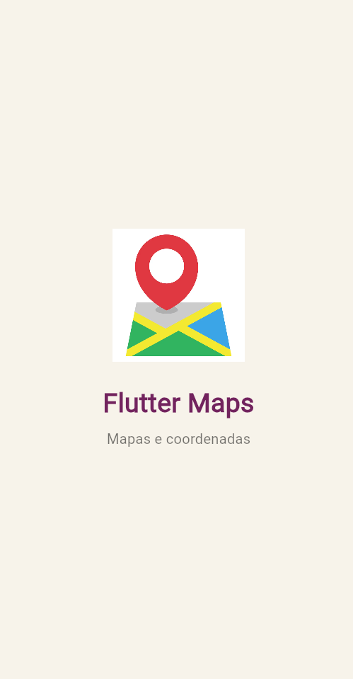
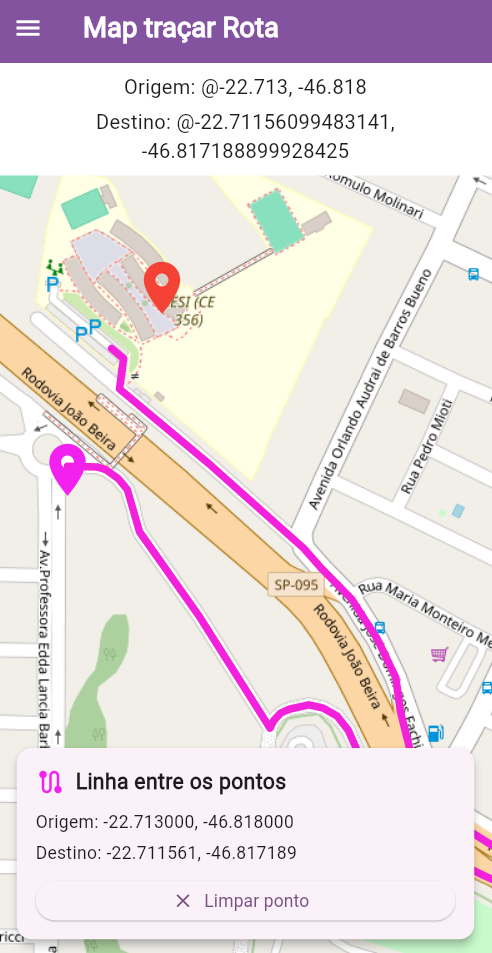
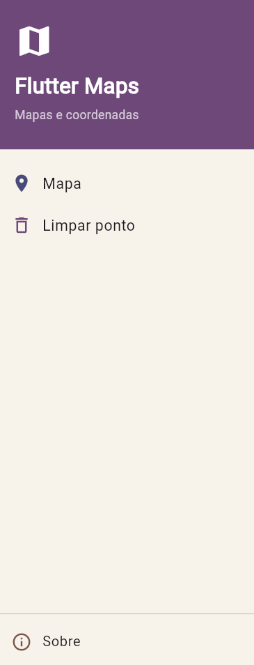

# Flutter Maps - Traçar Rota

 O projeto utiliza o **OpenStreetMap** para apresentar o mapa e o **OSRM (Open Source Routing Machine)** para realizar o cálculo de uma rota entre um local de origem e um destino escolhido pelo usuário.

---

## Sobre o projeto

O projeto foi desenvolvido com o objetivo de praticar a utilização de mapas em aplicações Flutter, possibilitando a interação do usuário com o mapa e a visualização de trajetos entre diferentes pontos.

Entre as funcionalidades disponíveis estão:

* Exibir um mapa;
* Selecionar um local diretamente no mapa;
* Consultar as coordenadas do ponto escolhido;
* Utilizar uma origem e um destino para criar uma rota;
* Calcular o caminho seguindo as ruas;
* Exibir o trajeto calculado no mapa;
* Remover o destino selecionado;
* Utilizar as opções disponíveis no menu lateral.

---

## Tecnologias utilizadas

* **Flutter**
* **Dart**
* **flutter_map**
* **latlong2**
* **HTTP**
* **OpenStreetMap**
* **OSRM**

---

## Funcionalidades

### Mapa

A aplicação exibe um mapa interativo utilizando os dados fornecidos pelo OpenStreetMap.

---

### Seleção de destino

Ao selecionar um ponto no mapa, o aplicativo obtém a latitude e a longitude correspondentes à localização escolhida.

O local selecionado recebe um marcador e suas coordenadas são exibidas na interface.

---

### Traçar rota

Após definir o destino, o aplicativo envia as informações de origem e destino para o **OSRM**, que realiza o cálculo do trajeto.

A rota é criada seguindo o percurso das ruas, proporcionando um caminho mais próximo de um trajeto real.

---

### Coordenadas

São exibidas na tela as coordenadas referentes ao ponto de origem e ao destino selecionado.

Exemplo:

```text
Origem: -22.713000, -46.818000

Destino: -22.710110, -46.817516
```

---

### Marcadores

O mapa utiliza marcadores com cores diferentes para representar os pontos envolvidos na rota:

* **Azul:** localização de origem;
* **Vermelho:** localização de destino.

---

### Menu lateral

O aplicativo conta com um menu lateral que reúne opções para facilitar o acesso aos recursos disponíveis.

---

## Telas do aplicativo

### Tela inicial

Tela principal da aplicação, onde o mapa é apresentado juntamente com o ponto de origem.



### Rota traçada

Tela que apresenta o destino escolhido e o trajeto calculado pelo aplicativo de acordo com as ruas.



### Menu lateral

Tela responsável por apresentar as opções disponíveis no menu lateral.



---

## Como executar o projeto

### 1. Clonar o repositório

```bash
git clone URL_DO_SEU_REPOSITORIO
```

### 2. Entrar na pasta do projeto

```bash
cd flutter_maps_nativo
```

### 3. Instalar as dependências

```bash
flutter pub get
```

### 4. Executar o aplicativo

Para iniciar a aplicação no navegador:

```bash
flutter run -d chrome
```

Também é possível executar o projeto por meio de um emulador ou de um dispositivo conectado.

---

## Dependências

As principais bibliotecas utilizadas no desenvolvimento são:

```yaml
dependencies:
  flutter:
    sdk: flutter
  flutter_map: ^8.2.2
  latlong2: ^0.9.1
  http: ^1.0.0
```

---

## Como funciona a rota

O cálculo do trajeto é realizado pelo **OSRM (Open Source Routing Machine)**, que determina o caminho entre a origem e o destino.

Quando o usuário escolhe um destino, o processo ocorre da seguinte forma:

1. O aplicativo identifica a latitude e a longitude do destino;
2. As coordenadas da origem e do destino são enviadas ao OSRM;
3. O OSRM calcula o percurso utilizando as ruas disponíveis;
4. O aplicativo recebe os pontos que representam o trajeto;
5. Esses pontos são utilizados para desenhar a rota sobre o mapa.

Assim, o caminho apresentado acompanha as ruas disponíveis, em vez de apenas conectar os dois locais por uma linha reta.

---

## Estrutura do projeto

```text
flutter_maps_nativo/

│
├── android/
├── ios/
│
├── lib/
│   ├── main.dart
│   │
│   ├── screens/
│   │   ├── splash_screen.dart
│   │   └── mapa_screen.dart
│   │
│   └── widgets/
│       ├── menu_lateral.dart
│       └── coordenadas_card.dart
│
├── assets/
│   ├── app-release.apk
│   │
│   ├── icons/
│   │   └── app_icon.png
│   │
│   └── screenshots/
│       ├── inicio.png
│       ├── rota.png
│       └── menu.png
│
├── test/
├── pubspec.yaml
├── pubspec.lock
└── README.md
```

---

## APK

O arquivo APK da aplicação está localizado em:

```text
assets/app-release.apk
```

Para gerar uma nova versão do APK, utilize:

```bash
flutter build apk --release
```

Depois da compilação, o arquivo será gerado em:

```text
build/app/outputs/flutter-apk/app-release.apk
```

Caso necessário, o arquivo pode ser copiado para:

```text
assets/app-release.apk
```

---

## Ícone do aplicativo

O projeto possui um ícone personalizado armazenado no seguinte caminho:

```text
assets/icons/app_icon.png
```

Esse ícone é utilizado para representar visualmente o aplicativo e também pode ser apresentado na tela inicial.

---

## Imagens do projeto

As capturas de tela utilizadas neste README estão organizadas na pasta:

```text
assets/screenshots/
```

Arquivos:

```text
inicio.png
rota.png
menu.png
```

---

## Projeto desenvolvido para

**Curso:** Desenvolvimento de Sistemas
**Atividade:** Aula 05 - Mapas
**Tecnologia:** Flutter

---

## Autora

**Pietra Vitória Fernandes Lopes**

Projeto desenvolvido como atividade acadêmica do curso de Desenvolvimento de Sistemas.
